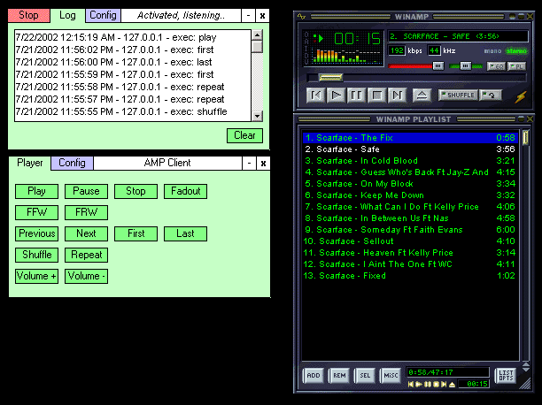



## AmpClient/AmpServer

### Description

Remotely control Winamp over a network using winsock and Winamp IPC. The code includes a class module to interface with Winamp's IPC's.
 
### More Info
 

             |
---                |---
**Submitted On**   |2002-07-22 19:31:42
**By**             |[MMeijer](https://github.com/Planet-Source-Code/PSCIndex/blob/master/ByAuthor/mmeijer.md)
**Level**          |Beginner
**User Rating**    |5.0 (30 globes from 6 users)
**Compatibility**  |VB 6\.0
**Category**       |[Sound/MP3](https://github.com/Planet-Source-Code/PSCIndex/blob/master/ByCategory/sound-mp3__1-45.md)
**World**          |[Visual Basic](https://github.com/Planet-Source-Code/PSCIndex/blob/master/ByWorld/visual-basic.md)
**Archive File**   |[AmpClient\_152460152003\.zip](https://github.com/Planet-Source-Code/mmeijer-ampclient-ampserver__1-37152/archive/master.zip)

